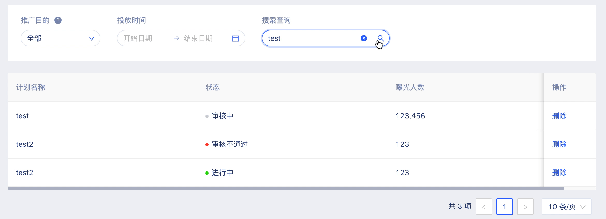

# 1-table

## loading

## 筛选项

* 筛选项宽度自适应
* select，默认全部，如果切换到了某个选项，需要可以再返回全部
* 时间、时间段选择，需要设置不可选的字段，一般为今日之后的数据不可选择

## 
* 关键字搜索，输入了未点击搜索按钮如何处理

## switch，切换了之后，需要刷新列表

## 不同状态的值，区分状态展示

## 列表图片预览

## 操作提示
* 对于那种改变数据库值的操作

## 列表宽度

## 固定列

## 统一的列表分页器

## 记住筛选项